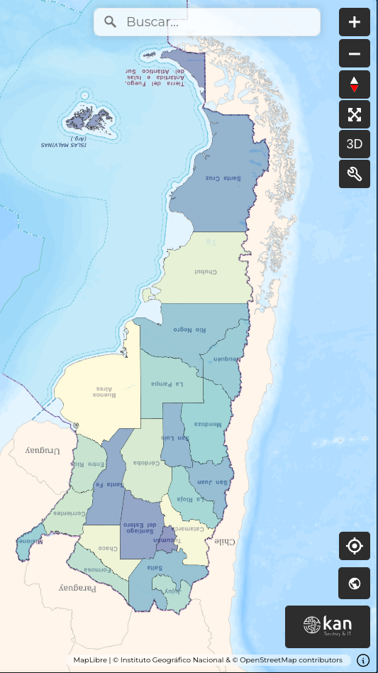
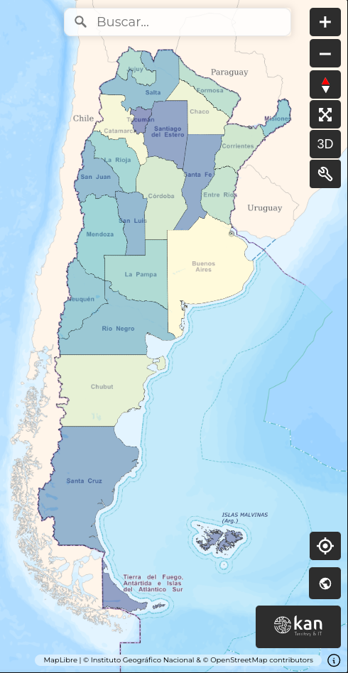
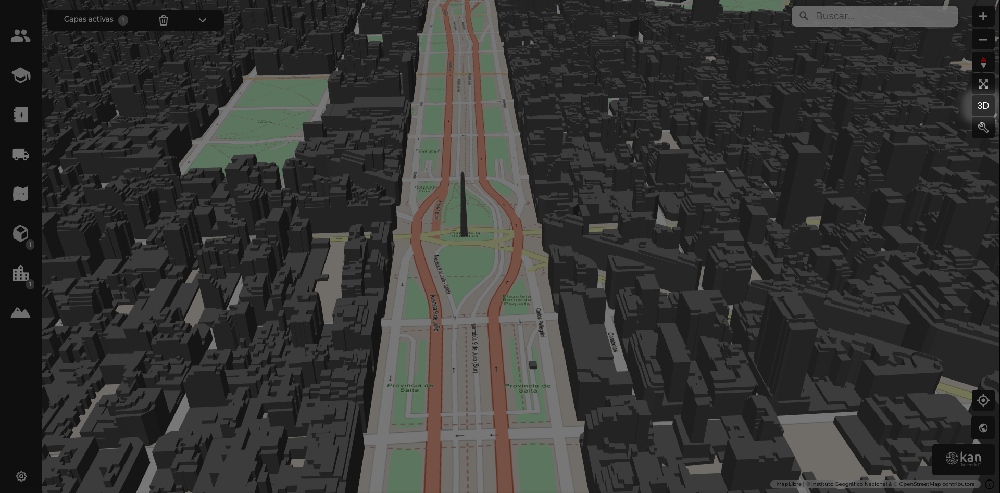
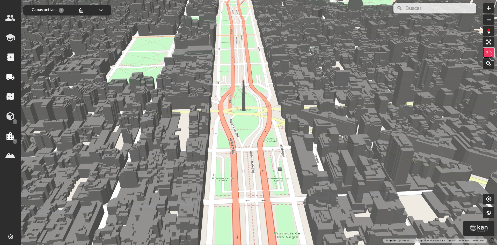

# Herramientas de orientación

## Orientación

En ocasiones, el mapa no tendrá el norte orientado hacia arriba, tal como se lo ve convencionalmente en los mapas, y entonces tendrá los puntos cardinales rotados. Para ayudar al usuario a orientarse en todo momento, el visor posee un ícono de brújula que cumple esa función. Como toda brújula, su aguja roja siempre apunta hacia el norte sin importar cuán rotado esté el mapa.

Para que el mapa vuelva a tener el norte arriba, solo hace falta hacer clic sobre dicho ícono.

## Vista 3D/2D

El visor Geoexpress ofrece la ventaja de poder mostrar capas tanto en 3D como en 2D.

Para optimizar la visualización de cada tipo de capa, el visor incluye una vista 3D y una vista 2D, siendo esta última la visualización cenital predeterminada del mapa. Entre las herramientas de navegación, el ícono de vista 3D, al hacer clic, activa dicha vista, inclinando el mapa para permitir una mejor apreciación del relieve en capas 3D, ya sea de una capa vectorial, un objeto 3D, un DEM o un mesh.

Para volver a la vista 2D desde la 3D, basta con hacer clic nuevamente en el mismo ícono.

